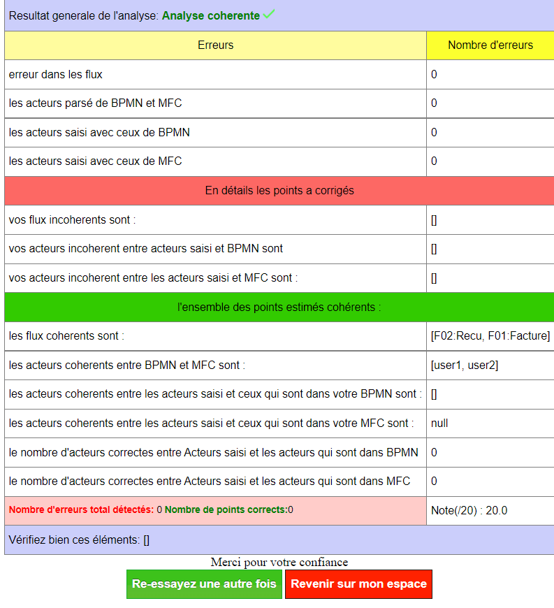

 
# PROJET 
# Sujet du projet 
Réalisation d'un site  **GC CHECKER** " https://www.gccheker.fr/ " qui a pour role de vèrifier la cohérence entre les diffèrents flux (Bpmn,mfc,acteurs,objectifs tactiques, objectifs strategiques) en demandant tous simplement aux utilisateurs de saisir ces dérniers en text et d'autres en type fichier afin que nous puissions renvoyer un résultat pertinent.

### comment accèder au site :
directemnt par: 
-  **admin** [ici](https://admin.gccheker.fr/)   --> (login :admin et mot de passe: admin)
- **prof** [ici](https://www.authpro.com/auth/Authgcchecker/?fbclid=IwAR15KujBPjWQO2KZ2TGbDXzQXmQOe8TbOLQgljReAy6kL9DpIlul_M4VGZo)   -->(login : prof et mot de passe : prof) 

les identifiants FTP: 
le site est hébergé sur [amen](https://www.amen.fr/) voici les accées en FTP: 
Host : ftp.onstatic-fr.setupdns.net
port: 21
identifiant: gccheker
mot de passe: Azer2020*** 

# Equipe du projet

Les mêmbres de l'équipe impliqués dans la conception et le développement de l'application sont :

- Lydia **TARMELIT**
- Noufel **GACI**
- Romain **MOREL**
- Sabrina **KELLAL**
- Johanna **Pululu**

## Structuration du projet

Le projet se répartit de la façon suivante :
#  Front-End : 
dans le dossier front-End vous trouverez ces sous dossiers: 
- **www** :  représente le front-end de tous l'accueil du site.
- **etudiant** : représente le front-end d'etudiant.
- **Prof** : représente le front-end de l'espace Prof.
- **admin** : représente le front-end de l'espace admin.

## Fontionnalité mise en ouevre 
- **Authentification et Authentization** : gérée par un API ([AuthPro](https://www.authpro.com/cgi-bin/manager.fcgi))(login :Authgcchecker ,mot de passe: Kenzo2018*** ), on proposant une authentification assez sécurisé qui gére les redirections vers des sous domains(**etudiant**.gccheker.fr et **prof**.gccheker.fr et **admin**.gccheker.fr), cela permet de donner des droits d'accées déffirentes d'un type utilisateur a un autre (ex: le prof pourra voir les utilisateurs qui sont encore en ligne et le nombre d'inscrits et aussi et les contacts des dévéloppeurs et les statistiques  de réussite des projets crée par les utilisateurs,  etc..) sachant que les étudiants aurronts accés seulement a l'application de validation d'analyse. 
- **Live chat**: une application de LIVE CHAT disponible en bas a droite de tout le site, cela permet de contacter que soit le prof ou bien le service du site en cas de problemes ou peu importe la demande du client. 
- **Application d'analyse** : l'application permets de laisser le choix aux utilisateurs de saisir déffirents champs(text et fichier) pour que on puisse regarder la cohérence entre ces dérniers et d'afficher un résultats générale de l'analyse . 

## Back-End
## Technologies utilisés et framework utilisé 
- JavaEE, javascript, REACTJS, JSP, HTML5, CSS3, 
### Version des technologies 
- pour le serveur d'application: APache Tomcat V9.0 
- Java 11 (JDK11 d'oracle)

## Architecture exploité 
### MVC 
")

### Plus de détails

- **Explication** :  [par ici](https://gitlab-etu.fil.univ-lille1.fr/tarmelit/projet/-/blob/main/back-end/README.md) 

 

### Tester en local 
- il suffit de cloner le projet et de l'importer sur votre IDE(ex: eclipse) puis ajouter l'api (**javax.servlet-api-3.0.1.jar**) dans votre BuildPath 
- téléchargez le serveur tomcat v9.0, puis créer un serveur et ajouter l'application 
- lancez le serveur, puis essayez cette requete sur votre navigateur: **localhost:8080/NomDeDepot/controleur ** , votre application est lancé! 
## Exemple de bon fonctionnement 
- prenez les fichier XML qui sont dans ce dossier : 

### Cas de saisie correcte (Analyse cohérente) :
- pour ce cas insérez ce [BPMN](https://gitlab-etu.fil.univ-lille1.fr/tarmelit/projet/-/raw/main/xmlToTest/BpmnValide.xmi?inline=false) et ce [MFC](https://gitlab-etu.fil.univ-lille1.fr/tarmelit/projet/-/raw/main/xmlToTest/MfcValide.xml?inline=false) dans le bon endroit de l'application pour avoir un résultat comme ci-dessous: 

### Cas de saisie incorrect(Analyse non cohérente) :
- pour ce cas insérez ce [BPMN](https://gitlab-etu.fil.univ-lille1.fr/tarmelit/projet/-/raw/main/xmlToTest/BpmnNonValide.xmi?inline=false) et ce [MFC](https://gitlab-etu.fil.univ-lille1.fr/tarmelit/projet/-/raw/main/xmlToTest/MFCNonValide.xml?inline=false) dans le bon endroit de l'application pour avoir un résultat comme ci-dessous: 

### Cas de l'analyse non saisie : 

- on as pris en compte quand l'utilisateur a rien saisies 

