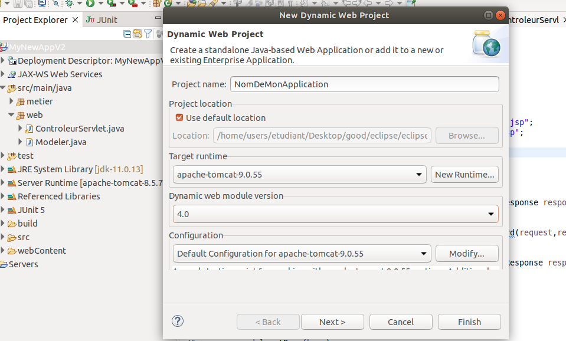
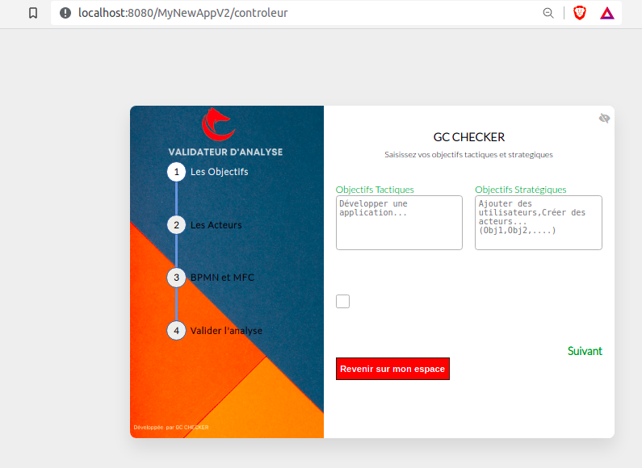

### Explicatoin approfondie sur le BACK-END
- Type de projet: **Dynamic web project** 
- Api externe: **javax.servlet-api.jar** , a télécharger par [ici](https://repo1.maven.org/maven2/javax/servlet/servlet-api/3.0-alpha-1/servlet-api-3.0-alpha-1.jar)
- serveur d'application: **Apache Tomcat V9.0** , a télécharger par [ici](https://dlcdn.apache.org/tomcat/tomcat-9/v9.0.60/bin/apache-tomcat-9.0.60.zip)

- voici un exemple sur **ECLIPSE JEE**: 

- **Détails: **
- on respectant l'architeutre MMVC de JEE, nous avons déviser les parties en 3 parties qui sont : 
ControleurServlet qui est une servlet qui récupere les données saisie dans la vue(par l'utilisateur, s'appele **webContent/VueRequest.jsp** dans notre cas) et fait appel a la couche métier pour faire les traitement(parser les fichier BPMN et MFC et aussi les autres champs de saisie text..), le ControleurServlet recupere les résultats de cette couche métier et les stocker dans le Modele(il s'appelle Modeler dans notre cas ) puis il vas faire l'appel a la VueResult avec un forward et afficher les résultats stocké dans le Modeler. 

### Tester en local 
- il suffit de cloner le projet et de l'importer sur votre IDE(ex: Eclipse), puis ajouter l'api (**javax.servlet-api-3.0.1.jar**) dans votre BuildPath que vous pouvez la trouver avec ce lien : [ici](https://repo1.maven.org/maven2/javax/servlet/servlet-api/3.0-alpha-1/servlet-api-3.0-alpha-1.jar)
- téléchargez le serveur tomcat v9.0, puis créer un serveur et ajouter l'application 
- lancez le serveur, puis essayez cette requete sur votre navigateur: **localhost:8080/NomDeDepot/controleur ** , votre application est lancé!  

## Interface d'application lors du lancement
- on as pris en compte quand l'utilisateur a rien saisies 

